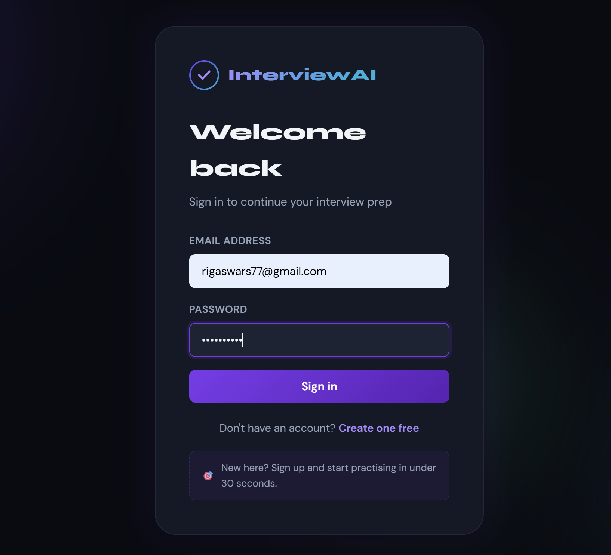
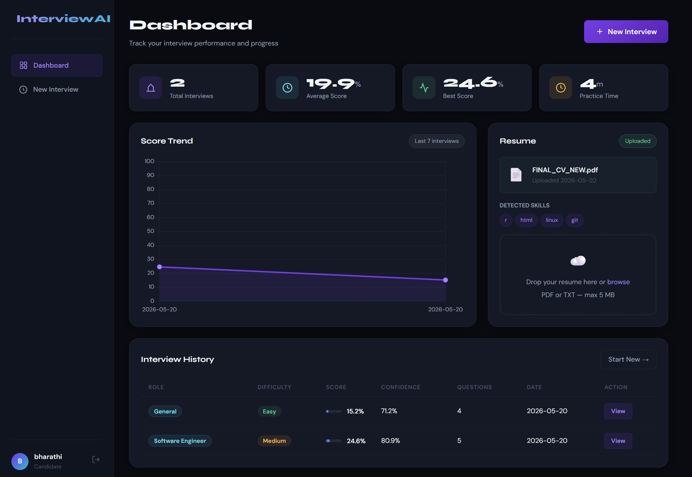
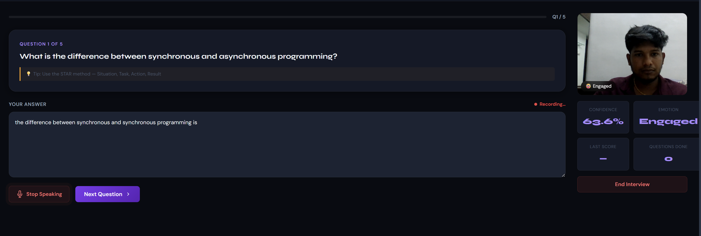
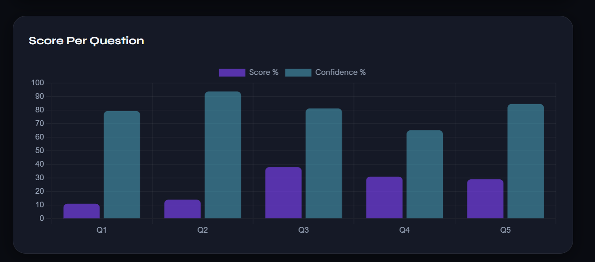
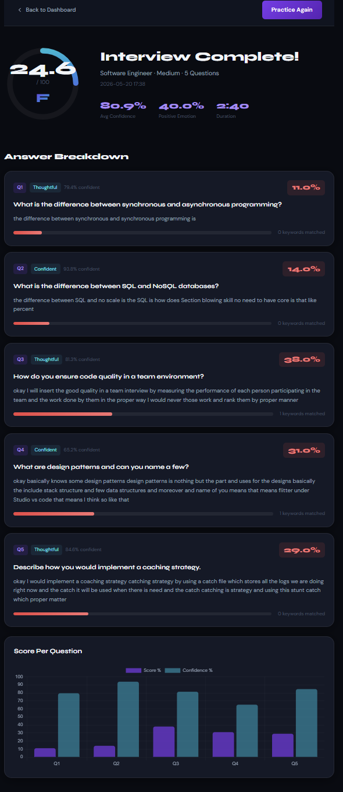

# AI-Smart-Interview-Assistant

AI-powered mock interview platform with speech analysis, webcam monitoring, real-time interview analytics, and automated candidate performance evaluation.

---

# Overview

AI-Smart-Interview-Assistant is an intelligent interview simulation platform designed to help users practice technical and HR interviews in a real-time environment. The system integrates speech processing, computer vision, and analytics to evaluate candidate performance and provide automated feedback.

The platform monitors user interaction through webcam analysis, speech-to-text processing, and real-time behavioral tracking to improve interview preparation and communication skills.

---

# Features

- AI-powered mock interview simulation
- Real-time webcam monitoring
- Speech-to-text processing
- Interview performance analytics
- Candidate behavior analysis
- Automated feedback generation
- Real-time dashboard
- Facial activity monitoring
- Interactive question-answer workflow
- User-friendly interface

---

# Tech Stack

## Frontend
- HTML
- CSS
- JavaScript

## Backend
- Python
- Flask

## AI & Computer Vision
- OpenCV
- SpeechRecognition
- NLP Processing

---

# System Workflow

1. User starts mock interview
2. Webcam captures facial activity
3. Speech-to-text converts responses
4. System analyzes candidate interaction
5. Analytics dashboard displays performance
6. Automated feedback generated

---

# AI Integration

The system integrates:
- Computer Vision for facial activity analysis
- Speech Recognition for response processing
- NLP techniques for interaction analysis
- Real-time analytics for performance tracking

---

# Key Functionalities

- Live interview monitoring
- Automated response tracking
- Behavioral analytics
- Communication assessment
- Real-time feedback generation
- Performance visualization dashboard

---

# Screenshots

## Login Interface


---

## Main Dashboard


---

## Analytics Dashboard


---

## Advanced Analytics View


---

## Invoice Generation


---

## Webcam Monitoring


---

# Installation

## Clone Repository

```bash
git clone https://github.com/RIGASWAR/AI-Smart-Interview-Assistant.git
```

## Navigate to Project Folder

```bash
cd AI-Smart-Interview-Assistant
```

## Install Dependencies

```bash
pip install -r requirements.txt
```

## Run Application

```bash
python app.py
```

---

# Future Enhancements

- AI-generated interview questions
- Emotion recognition integration
- Resume-based question generation
- Voice confidence analysis
- Online interview rooms
- Multi-language support

---

# Contributors

- Rigaswar S

---

# License

This project is developed for educational and research purposes.
